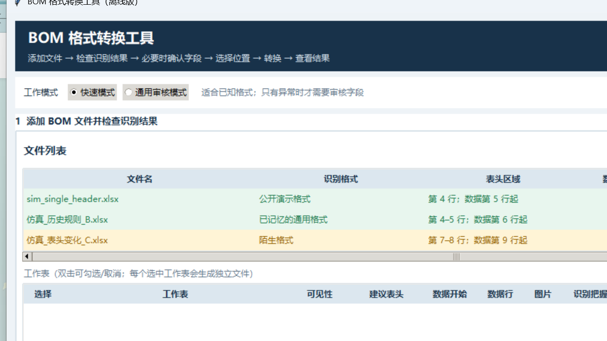
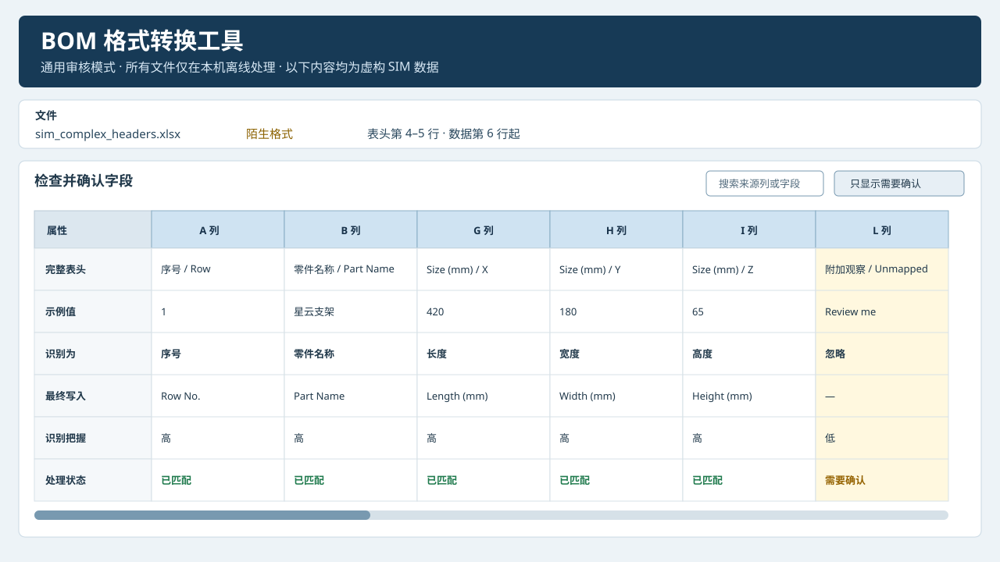
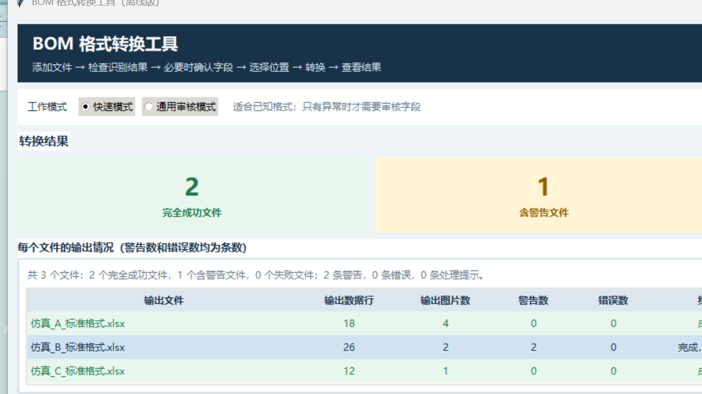

# Offline BOM Converter / 离线 BOM 格式转换工具

一个面向复杂 `.xlsx` 物料清单的离线、可解释格式转换工具。它把不同来源表格先映射到通用中间层，再写入用户选择的输出模板；所有读取、分析、规则记忆和文件生成都在本机完成。

An offline, explainable converter for heterogeneous `.xlsx` bills of materials. Source columns are mapped into a neutral intermediate model before data is written into a user-selected output template. Reading, analysis, rule storage, and output generation all stay on the local machine.

> 本仓库是为学习、个人作品展示和技术交流准备的脱敏公开版，不是内部验收版的完整镜像。仓库不包含真实业务工作簿、内部模板、专用格式规则、历史输出或可执行文件。
>
> This is a privacy-safe public edition for learning, portfolio presentation, and technical discussion. It is not a full mirror of the internally validated edition and contains no real workbooks, internal templates, private profiles, historical outputs, or executables.

## 界面预览 / UI preview

以下界面只使用固定种子虚构数据。通用审核页采用 Excel 式横向字段矩阵：来源列横向排列，字段属性纵向排列。

All previews use deterministic fictional data. The audit view presents source columns horizontally and mapping properties vertically.

| 快速模式 / Quick mode | 通用审核 / Mapping audit |
| --- | --- |
|  |  |



## 解决的问题 / Problem statement

真实世界中的 BOM 往往存在标题行、说明行、多行或合并表头、中英双语字段、单位差异、多 Sheet、层级标记和单元格图片。直接按固定列号复制很容易错位，也难以解释错误来源。本项目采用“表头区域识别 → 人工确认 → 通用中间层 → 模板写入 → 完整性检查”的流程。

Production spreadsheets frequently contain title blocks, multi-row or merged headers, bilingual labels, unit variations, multiple worksheets, hierarchy markers, and cell-anchored images. Fixed column offsets are fragile. This project uses a staged pipeline: header-region discovery, user confirmation, neutral intermediate representation, template writing, and integrity verification.

```text
XLSX package
   │
   ├─ worksheet values + merged ranges + drawing anchors
   ▼
HeaderRegion (start/end/data row, full header paths, units, confidence reasons)
   ▼
User-confirmed column rules / local rule recall
   ▼
BomRow intermediate model (text, dimensions, weights, levels, image references)
   ▼
Template-preserving OpenXML writer + compatibility checks + local issue report
```

## 主要功能 / Highlights

- 识别 1–5 行连续表头区域，并逻辑传播横向和纵向合并单元格。
- 把中文、英文和父子表头保留为完整路径，例如 `Size (mm) / X`。
- 使用 A、B、C、…、Z、AA、AB 等 Excel 列标和横向映射矩阵。
- 支持人工修改字段、忽略列、手动指定表头范围与数据开始行。
- 检测多个候选 BOM Sheet，默认排除说明页和空页；每个选中 Sheet 单独输出。
- 支持名称组合策略、空字段跳过和去重；名称中的 `×` 不会被尺寸清洗逻辑改写。
- 支持尺寸字符串拆分，以及重量、长度和面积单位换算。
- 支持 L1–L13 或其他多列层级组；多标记和无标记会生成明确警告。
- 图片按来源数据行和锚点复制，不重新编码图片字节。
- 映射记忆只保存表头与规则，不保存示例值、数据行、零件名称/编号或图片。
- 同一窗口可开始新任务，保留模板和输出目录，清除上一任务的临时状态。
- 结果页直接显示处理提示、需要检查和不能使用三类问题。
- 转换前后校验来源文件与模板未被改写。

- Detects 1–5 row header regions and logically propagates merged cells.
- Preserves bilingual and parent/child paths such as `Size (mm) / X`.
- Provides Excel column labels and a horizontal mapping matrix.
- Supports manual field/range confirmation, multi-sheet output, name rules, units, dimensions, level groups, images, local rule recall, new-task reset, and user-facing issue details.
- Protects source files and performs OpenXML package compatibility checks.

## 公开版与内部版的差异 / Public-edition boundary

- 所有来源于非公开工作簿结构的固定 Profile 已删除。
- 仅保留一个完全虚构的 `sim_demo` Profile，用于展示快速路径。
- 默认模板由零开始生成，字段、样式、公式和占位图片均为通用虚构内容。
- 三个演示工作簿采用固定种子 `20260827`，不包含真实名称、编号、供应方、价格、图片或组织信息。
- 本仓库不提供 EXE 或 Release；是否公开发布二进制需要另行确认模板与代码权属。

- All fixed profiles derived from non-public workbook structures were removed.
- One fictional `sim_demo` profile demonstrates the quick path.
- The bundled template was generated from scratch with generic fields and fictional placeholders.
- Three deterministic sample workbooks use seed `20260827` and contain no real identifiers, commercial values, images, or organization data.
- No executable or GitHub Release is included.

## 环境与安装 / Setup

要求 Python 3.10 或更高版本。运行时没有第三方 `pip` 依赖；图形界面使用 Python 自带的 Tkinter。Windows 的 Python 安装程序通常可选装 Tcl/Tk。

Python 3.10+ is required. The runtime has no third-party `pip` dependency; the GUI uses the Tkinter module shipped with Python distributions.

```powershell
python -m venv .venv
.\.venv\Scripts\Activate.ps1
python -m pip install -e .
```

启动通用审核模式：

```powershell
python run.py --mode audit
```

启动快速模式：

```powershell
python run.py --mode quick
```

公开演示模板位于 `assets/public_demo_template.xlsx`。实际使用时应选择自己有权处理的模板和 BOM。程序当前只支持 `.xlsx`；不支持旧式 `.xls`、宏工作簿、密码保护文件或在线翻译。

The public demo template is `assets/public_demo_template.xlsx`. For real use, select only templates and workbooks you are authorized to process. The current version supports `.xlsx` only; legacy `.xls`, macros, encrypted workbooks, and online translation are not supported.

## 测试 / Tests

公开测试完全基于仿真工作簿，并把转换输出与规则文件写入系统临时目录：

```powershell
$env:PYTHONPATH = "src"
python -m unittest discover -s tests -v
python tools/audit_public_repo.py
```

测试覆盖多行/合并/双语/XYZ 表头、Excel 列标、横向矩阵契约、多 Sheet、连续任务重置、第 5 行格式复制、单位/尺寸、名称规则、L1–L13、图片字节复制、规则隐私和 OpenXML 兼容性。公开测试不能替代任何组织对其真实文件的本地验收。

The public suite covers multi-row and merged headers, bilingual XYZ paths, Excel labels, the horizontal mapping contract, multi-sheet output, new-task reset, row-5 style cloning, units, dimensions, name rules, L1–L13, image-byte preservation, rule privacy, and OpenXML compatibility. Synthetic tests do not replace local acceptance testing with real authorized workbooks.

## 可选 EXE 构建 / Optional executable build

本仓库不提交 EXE。开发者可在确认模板权属后本地安装可选构建依赖，并使用 PyInstaller 生成自己的候选文件：

```powershell
python -m pip install -e ".[build]"
pyinstaller --noconfirm --clean --onefile --windowed --name "BOM转换器-快速版" --add-data "assets/public_demo_template.xlsx;assets" run.py
pyinstaller --noconfirm --clean --onefile --windowed --name "BOM转换器-通用版" --add-data "assets/public_demo_template.xlsx;assets" run.py
```

构建结果仍需在没有 Python 的 Windows 电脑上进行启动、转换和 Microsoft Excel 正常打开验收；仓库未把“可以构建”表述为“二进制已验收”。

## 项目结构 / Repository map

```text
assets/                    fictional public output template
docs/images/               sanitized UI previews
samples/simulated/         deterministic fictional XLSX workbooks
src/bom_converter/         analyzer, mapping, conversion, UI, OpenXML core
tests/                     privacy-safe public regression tests
tools/audit_public_repo.py release privacy and metadata audit
run.py                     GUI entry point
```

进一步设计说明见 [Architecture](docs/ARCHITECTURE.md)，隐私与审计说明见 [Privacy and testing](docs/PRIVACY_AND_TESTING.md)，第三方依赖见 [Third-party notices](THIRD_PARTY_NOTICES.md)。

## 维护者私有上传助手 / Maintainer-only private upload helper

仓库根目录提供`双击上传到GitHub私有仓库.bat`和`上传到GitHub私有仓库.ps1`。它们只用于维护者把当前已提交的`main`分支上传到预先指定的Private仓库；运行前会重新执行全部测试、Git跟踪文件审计和隐私检查。脚本拒绝脏工作区、错误账号、错误远端或非Private仓库，不使用强制推送，也不创建Release。运行结果写入被Git忽略的`github_upload_result.txt`。

The root upload helpers are maintainer-only. Before contacting GitHub they rerun the complete public test suite, inspect the tracked-file set, and execute the privacy gate. They refuse a dirty worktree, unexpected account or remote, and any repository that is not Private. They never force-push or create a Release; the local result file is ignored by Git.

## 已知限制 / Known limitations

- 表头自动推荐仍可能对缩写、低信息量列或高度定制格式给出低把握结果；此时必须人工确认。
- 图片复制针对 `.xlsx` 的 DrawingML 锚点；VBA、OLE 对象和嵌入文件不在支持范围内。
- 公式由 Excel 打开时重新计算；非 Excel 查看器的计算表现可能不同。
- 未在仓库中提供经过无 Python 电脑验收的二进制。
- 公开仿真样本不能证明任意真实业务文件都能正确转换。

## 隐私、安全与权属 / Privacy, security, and rights

- 核心处理不联网，不上传 Excel 内容。
- `.report.json` 和 `mapping_rules.json` 属于本地运行产物，已被 `.gitignore` 排除。
- 请勿提交真实 BOM、真实模板、输出、报告、规则或截图。
- 本仓库暂未附加开源许可证，仅用于学习、作品展示和技术交流。未提供许可证时，其他人默认没有复制、修改或分发代码的授权。
- 在转为公开仓库或接受外部贡献前，应先确认代码、模板、界面与业务规则的权属，再决定采用开源许可证或保持闭源。

- Core processing is offline and uploads nothing.
- Local reports and mapping rules are ignored by Git.
- Do not commit real workbooks, templates, outputs, reports, rules, or screenshots.
- No open-source license is attached yet. Without an explicit license, no permission to copy, modify, or redistribute is granted by default.
- Confirm ownership of the code, template, UI, and business rules before making the repository public or selecting a license.
